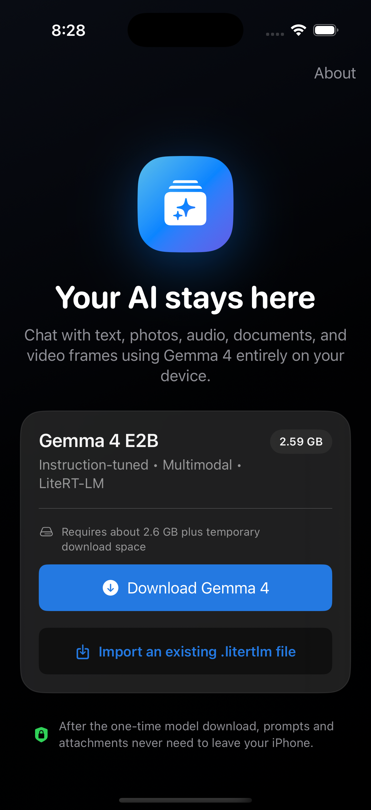

# Matha Atlas iOS

> **License:** Source available and free for organizations with no more than
> 100,000 monthly active users. Use above that threshold requires a separate
> commercial agreement, with a standard annual price basis of US $1 per MAU
> above 100,000. See [License](#license).

Matha Atlas is a native SwiftUI AI workspace that runs a multimodal Gemma model locally on iPhone and iPad. It combines private on-device chat, file and media ingestion, local knowledge retrieval, MCP tools, performance testing, and an optional Dispatch system for coordinating approved work on a paired Mac.

> **Project status:** Experimental developer release. The app works on a physical iPhone, but the Dispatch relay and desktop executor should be treated as development infrastructure rather than a hosted multi-user service.



## Highlights

- On-device, streaming, multi-turn Gemma chat through Google LiteRT-LM.
- Multiple persistent chats with search, rename, pinning, deletion, and Markdown export.
- Images from Camera and PhotosPicker.
- Microphone recording and local audio analysis.
- PDF, plain-text, Markdown, CSV, JSON, and source-code attachments.
- Video ingestion through chronological local frame sampling.
- Private local knowledge indexing and retrieval.
- MCP server connections with bearer credentials stored in the iOS Keychain.
- Local skills and typed local tools.
- Generation controls and real 128-, 500-, and 1,000-token performance tests.
- Native Dispatch, Agent View, live transcripts, approvals, recursive child tasks, and Remote Control.
- Optional macOS companion for approved Codex, Xcode, build, install, and launch operations.
- Optional local or Cloudflare Durable Object WebSocket relay.

The model weights are **not** stored in this repository. Matha Atlas downloads the selected `.litertlm` model after installation or imports one selected by the user.

## Architecture

```text
Matha Atlas iOS
├── SwiftUI chat and attachment pipeline
├── LiteRT-LM on-device inference
├── local chat and knowledge persistence
├── MCP clients and Keychain credentials
└── Dispatch UI
    ├── coordinator and recursive task graph
    ├── Agent View and live task transcripts
    └── Remote Control and approvals
             │
             │ authenticated WebSocket room
             ▼
       RelayService
             │
             ▼
       macOS companion
       ├── workspace/device policy
       ├── Codex executor
       └── Xcode/CoreDevice adapters
```

On-device chat does not require the relay or Mac companion. Dispatch is an optional development feature.

## Requirements

### iOS app

- macOS with a recent Xcode installation. The project was most recently verified with Xcode 26.x.
- iOS 17 or later.
- A physical Apple-silicon iPhone or iPad for useful model performance.
- Approximately 3.1 GB of free space during the first model download.
- A device with at least 6 GB RAM is strongly recommended.
- [XcodeGen](https://github.com/yonaskolb/XcodeGen) if regenerating the project.

### Optional Dispatch system

- Swift 6 toolchain.
- Node.js 22 or later and npm.
- Xcode command-line tools.
- GitHub's Codex executable at the path configured in `DesktopTaskExecutor.swift`, if using desktop Codex tasks.
- A paired physical Apple device for Xcode/CoreDevice installation features.
- A Cloudflare account only if deploying the relay publicly. Local-LAN Dispatch does not require one.

## Quick start: iOS app

### 1. Clone the repository

```sh
git clone https://github.com/RevanthM/Matha-Atlas-iOS.git
cd Matha-Atlas-iOS
```

### 2. Install XcodeGen

With Homebrew:

```sh
brew install xcodegen
```

### 3. Generate the Xcode project

```sh
xcodegen generate
```

`project.yml` is the source of truth for target settings. The generated project remains named `LocalGemma.xcodeproj`, and the internal target/scheme remains `LocalGemma`; the installed application and product name are **Matha Atlas**. The internal names are retained to avoid unnecessary source and migration churn.

### 4. Configure signing

1. Open `LocalGemma.xcodeproj`.
2. Select the `LocalGemma` target.
3. Open **Signing & Capabilities**.
4. Select your own Apple development team.
5. Change the default `com.matha.atlas` bundle identifier if it is not available for your team.
6. Select a connected iPhone or iPad as the run destination.

No development team, signing certificate, provisioning profile, or Apple credential is committed to this repository.

### 5. Build and run

Run the app from Xcode. On first launch:

1. Choose **Download Gemma 4**, or import an existing compatible `.litertlm` file from Files.
2. Keep the app open while the initial model compilation finishes.
3. Approve Camera, Photos, Microphone, Reminders, or Local Network access only when using the corresponding feature.

The first initialization is slower because LiteRT-LM creates device-specific compilation artifacts. Later launches reuse the local cache.

## Model setup

The default model entry points to the official LiteRT Community model package:

- [Gemma 4 E2B IT for LiteRT-LM](https://huggingface.co/litert-community/gemma-4-E2B-it-litert-lm)
- [LiteRT-LM project](https://github.com/google-ai-edge/LiteRT-LM)
- [Official LiteRT-LM Swift guide](https://developers.google.com/edge/litert-lm/swift)

The app downloads the model directly from the configured model host. Chat inference, attachment processing, and knowledge retrieval then run locally. Model weights and their license are separate from this repository and are not covered by the Matha Atlas source-available license.

### Importing a model manually

1. Download a compatible `.litertlm` model to Files.
2. Launch Matha Atlas.
3. Select **Import an existing `.litertlm` file**.
4. Choose the model.
5. Leave the app open until validation and initial compilation complete.

## Attachments and permissions

| Capability | Processing | Permission behavior |
|---|---|---|
| Camera photo | Local image input | Camera permission is requested only after choosing Camera. |
| Photos and videos | Local image input or sampled video frames | PhotosPicker grants access only to selected items. |
| Microphone | 16 kHz mono WAV recording | Microphone permission is requested only when recording starts. |
| PDF/documents | Local text extraction | The document picker grants access only to selected files. |
| Reminders tool | EventKit operation | Each tool operation is shown for confirmation. |
| Local MCP server | Network request to the configured endpoint | Local Network access is requested when connecting to a LAN service. |

Downloaded models live in the app container and are excluded from device backups. Chat data, knowledge indexes, server profiles, and Dispatch history remain in the app container. Bearer credentials are stored in Keychain, not UserDefaults.

## Build verification

### Simulator UI build

```sh
xcodebuild \
  -project LocalGemma.xcodeproj \
  -scheme LocalGemma \
  -destination 'generic/platform=iOS Simulator' \
  -derivedDataPath DerivedData \
  CODE_SIGNING_ALLOWED=NO \
  build
```

### Generic physical-device architecture build

```sh
xcodebuild \
  -project LocalGemma.xcodeproj \
  -scheme LocalGemma \
  -destination 'generic/platform=iOS' \
  -derivedDataPath DerivedDataDevice \
  CODE_SIGNING_ALLOWED=NO \
  build
```

## LiteRT-LM package layout

`Vendor/LiteRTLM` contains Google's unchanged Apache-2.0 Swift wrapper sources and the official LiteRT-LM `v0.15.0` iOS binary URL/checksum. This avoids downloading the full upstream Git-LFS repository when Swift Package Manager resolves the project.

The binary itself is downloaded from Google's GitHub release during the build and is not committed here. The wrapper retains its Google copyright headers and is accompanied by its Apache-2.0 license in `Vendor/LiteRTLM/LICENSE`.

## Optional: local Dispatch and Remote Control

Dispatch connects the iPhone to a macOS companion through an authenticated WebSocket room. Use this only on systems and workspaces you control.

### 1. Build and test the companion

```sh
cd DispatchSystem
swift test
swift build -c release
```

### 2. Install relay dependencies

```sh
cd RelayService
npm ci
npm run typecheck
cd ..
```

### 3. Generate and store a pairing secret

Generate a fresh secret locally and store it in macOS Keychain:

```sh
PAIRING_SECRET="$(openssl rand -hex 32)"
security add-generic-password \
  -U \
  -s com.matha.atlas.DispatchRelay \
  -a local-development \
  -w "$PAIRING_SECRET"
unset PAIRING_SECRET
```

Do not paste a real pairing secret into source files, screenshots, issues, or shell scripts. The included host script reads it from Keychain and writes the ignored `RelayService/.dev.vars` file with owner-only permissions at runtime.

### 4. Configure approved resources

From `DispatchSystem`:

```sh
.build/release/local-gemma-agent approve-workspace /absolute/path/to/your/workspace
.build/release/local-gemma-agent devices
.build/release/local-gemma-agent approve-device YOUR_COREDEVICE_IDENTIFIER
```

Use the CoreDevice identifier printed by the `devices` command. Do not copy someone else's identifier from documentation.

### 5. Configure the desktop relay URL

Choose a room identifier containing at least eight letters, numbers, `_`, or `-` characters:

```sh
.build/release/local-gemma-agent set-relay \
  ws://127.0.0.1:8787/v1/rooms/matha-atlas-dev/connect
```

### 6. Start the local relay and Mac host

```sh
./scripts/run-dispatch-host.zsh
```

The script:

- resolves the repository location dynamically;
- loads the secret from macOS Keychain;
- creates an ignored, mode-`600` `.dev.vars` file;
- starts Wrangler on port `8787`;
- health-checks the relay; and
- starts the release desktop companion.

Keep that terminal open unless you install the script as a personal `launchd` service.

### 7. Pair the iPhone

1. Make sure the Mac and iPhone are on the same trusted network.
2. Open Matha Atlas → hamburger menu → **Dispatch center** → **Remote**.
3. Select **Pair or configure desktop**.
4. Enter `ws://YOUR_MAC_LAN_IP:8787` as the relay base URL.
5. Enter the same room identifier used by the desktop.
6. Enter the generated pairing secret.
7. Connect and accept iOS Local Network permission if prompted.

The secret is stored in the iOS Keychain. The relay URL and room identifier are not secrets.

### Local Dispatch limitations

- The Mac must be awake and online for desktop, Xcode, filesystem, and physical-device work.
- The iPhone queues unsent tasks in memory and retries its WebSocket connection; the current relay is not a durable offline job queue.
- The current relay uses one configured pairing secret and is intended for a single trusted user/development environment.
- Approval requests are held by the running desktop daemon. Restarting the daemon discards in-memory pending executions.
- Pause/cancel state is synchronized, but a currently blocking child process is not force-terminated in this release.

## Optional: deploy the relay to Cloudflare

The Worker configuration is in `DispatchSystem/RelayService/wrangler.toml`.

```sh
cd DispatchSystem/RelayService
npm ci
npx wrangler login
npx wrangler secret put PAIRING_SECRET
npm run deploy
```

`wrangler secret put` prompts for the value without requiring it in a tracked file. After deployment, configure both the Mac and iPhone to use the resulting `wss://` endpoint and the same room identifier.

The Worker relays live WebSocket messages through a Durable Object. It does not currently persist disconnected messages, perform per-user account management, or provide end-to-end payload encryption.

## Repository secrets and generated files

The `.gitignore` excludes:

- Xcode DerivedData and build products;
- `.build`, `.swiftpm`, Wrangler, and npm caches;
- `.dev.vars` and `.env` files;
- Xcode user data;
- provisioning profiles, certificates, private keys, and packaged apps;
- downloaded model artifacts.

Before opening a pull request, confirm that secrets remain untracked:

```sh
git status --short
git grep -n -I -E 'gh[opsu]_[A-Za-z0-9_]+|AKIA[0-9A-Z]{16}|BEGIN [A-Z ]*PRIVATE KEY'
```

The second command should produce no output. It is only a basic check; never rely on a regex scan as permission to commit a credential you recognize.

## Project structure

```text
LocalGemma/                     iOS application source
Vendor/LiteRTLM/                vendored Apache-2.0 Swift wrapper
DispatchSystem/
  Sources/DispatchCore/         task graph, protocol, and policy
  Sources/DispatchUI/           Dispatch/Agent/Remote SwiftUI
  Sources/LocalGemmaAgent/      macOS companion executable
  RelayService/                 Cloudflare Worker relay
  Tests/                        Dispatch policy/protocol tests
docs/                           repository images
project.yml                     XcodeGen source of truth
```

## Troubleshooting

### Xcode cannot sign the app

- Select your own team in Signing & Capabilities.
- Use a bundle identifier unique to your Apple Developer account.
- Confirm the physical device trusts the development computer.

### The model download fails

- Confirm the device has enough free storage.
- Open the model URL in Safari to verify network access.
- Download the `.litertlm` file separately and use the import flow.

### Dispatch says “Connection failed”

- Confirm the relay health endpoint responds: `curl http://127.0.0.1:8787/health`.
- Confirm iOS Local Network permission is enabled for Matha Atlas.
- Confirm the Mac and iPhone use the same room and pairing secret.
- Use the Mac's LAN address on the iPhone, not `127.0.0.1`.
- Confirm port `8787` is reachable on the trusted network.

### The Mac host appears but a task does not run

- Run `.build/release/local-gemma-agent status`.
- Confirm the workspace and device are explicitly approved.
- Open Remote Control and check for a pending approval.
- Review `~/Library/Application Support/LocalGemmaDispatch/TaskGraph.json` for local task state.

## Contributing

1. Fork the repository.
2. Create a focused branch.
3. Keep credentials, model weights, DerivedData, and personal signing files out of commits.
4. Run `swift test`, relay type-checking, and an unsigned iOS build.
5. Open a pull request describing behavior changes and validation.

## License

The original Matha Atlas code is distributed under the [Matha Atlas Source Available License 1.0](LICENSE):

- Free use is permitted while an organization has no more than **100,000 monthly active users** in every calendar month.
- Use above 100,000 MAUs requires a separate written commercial agreement.
- The standard commercial pricing basis is **US $1 per MAU above 100,000 per year**. By default, the annual calculation uses the highest monthly count in that license year. For example, a peak of 125,000 MAUs produces a US $25,000 annual pricing basis.
- Payment by itself does not grant a license; contact the repository owner through [GitHub](https://github.com/RevanthM) before exceeding the threshold.

This is a **source-available** project, not an OSI-approved open-source project. The `LICENSE` file is the controlling text. Because this is a custom business license, obtain legal review before relying on it for enforcement or a production commercial program.

Third-party components retain their own licenses. In particular, `Vendor/LiteRTLM` remains Copyright Google LLC and Apache-2.0 licensed. See [THIRD_PARTY_NOTICES.md](THIRD_PARTY_NOTICES.md) and [Vendor/LiteRTLM/LICENSE](Vendor/LiteRTLM/LICENSE).

Gemma model weights are not included and are governed by the terms published with the selected model.

## Disclaimer

Matha Atlas can produce incorrect or unsafe output. Do not rely on it for high-stakes medical, legal, financial, safety, or security decisions without appropriate domain-specific review and safeguards.
